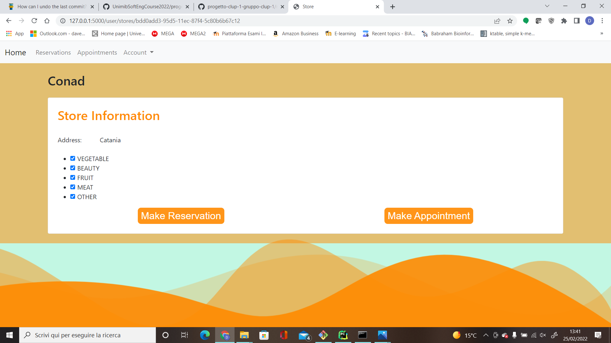
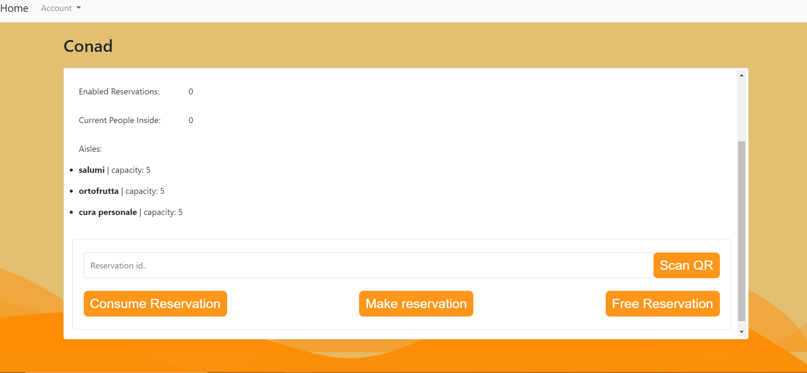

# CLup Project

Progetto realizzato in `python` che si pone come obiettivo la creazione di un sistema di prenotazioni online presso i negozi per potersi mettere in coda comodamente da casa senza creare affollamenti davanti ai negozi.  

## Setup e First Run 

0. Clonare il repository di questo progetto: 
    - `git clone https://github.com/UnimibSoftEngCourse2022/progetto-clup-1-gruppo-clup-1.git`
1. Installazione `env` (l'ambiente virtuale di python): 
    - Entrare nella cartella del progetto da linea di comando.
    - lanciare il comando: `python -m venv env`(oppure usare `py` al posto di `python` a seconda dell'installazione effetuata)
2. Attivazione env: 
    - su Windows lanciare il comando `env/Scripts/activate.bat` altrimenti su Linux lanciare il comando `source env/bin/activate`
3. Installazione del requirements file:
    - lanciare il comando `pip install -r requirements.txt`
4. Lanciare il server:
    - su Windows lanciare il comando`run_flask.bat` altrimenti su Linux lanciare il comando `./run_flask.sh`
    - aprire nel browser l'indirizzo `http://127.0.0.1:5000/`
5. Inizializazione dati dal database:
    - aprire nel browser l'indirizzo `http://127.0.0.1:5000/init`
     
## Esempio di uso tipico: effettuare una reservation

1. Dalla home page schiacciare il pulsante **get Started** per accedere alla pagina di login.  
2. Aperta la pagina login si potrà registrare un nuovo utente facendo click sul link **singup**.  
3. Selezionare campo **user**.  
4. A questo punto registrarsi inserendo la propria e-mail e la password ed effettuare l'accesso con le credenziali
appena registrate.  
5. Una volta effettuato l'accesso selezionare lo store **Conad**.   
6. Effettuare poi una prenotazione attraverso il pulsante **make reservation**.  
7. Al momento della make reservation verrà inviata automaticamente un e-mail contente il qrcode relativo alla prenotazione appena effettuata.  
8. A questo punto bisognerà effettuare il logout cliccando sul campo **Account** e successivamente **logout** direttamente dalla navbar.  
  
9. Dalla pagina di login effettuare  nuovamente l'accesso ma con le seguenti credenziali:  
   - admin2@example.clup.com  
   - password  
10. Effettuato il login come admin si potrà così scansionare il qr code delle reservation attraverso il pulsante **scan qr**.  
11. Una volta dato accesso alla camera del dispositivo si potrà così scansionare il qrcode appena ricevuto via posta elettronica.  
12. Premendo il tasto **consume reservation** si potrà notare così che lo user percedentemete in fila sarà inserito nel negozio.  
13. In conslusione premere il tasto **free reervation** per registrare l'uscita del cliente dal negozio così liberando un posto.  
  

## Documentazione

La documentazione del progetto si trova nella cartella `doc` sotto la root del progetto.  

## Contributo
Il contributo per la realizzazione di questo progetto è stato dato da:  
- Davide Monti  
- Riccardo Frigerio  
- Davide Soldati  
- Mattia Napoli  

