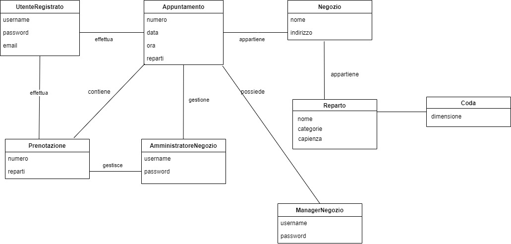
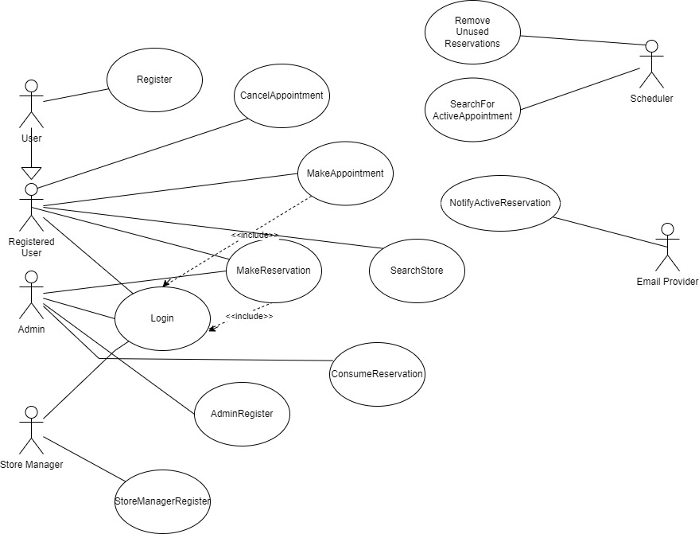
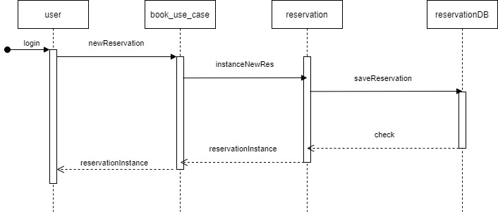
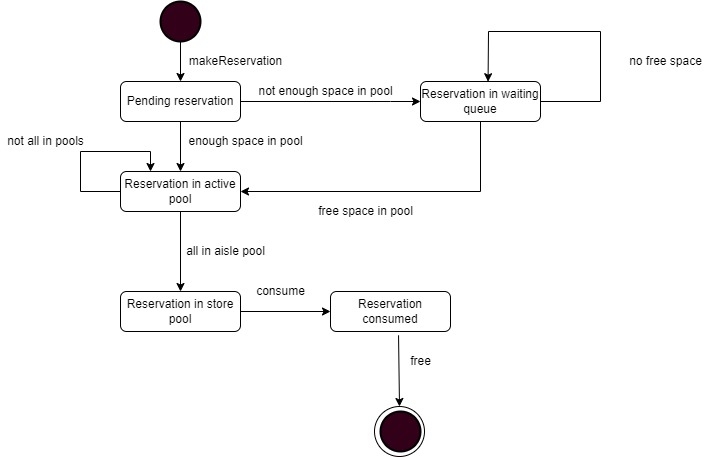
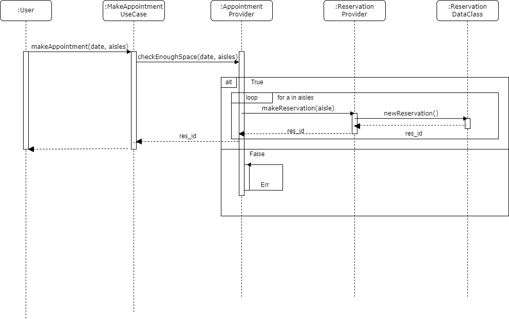
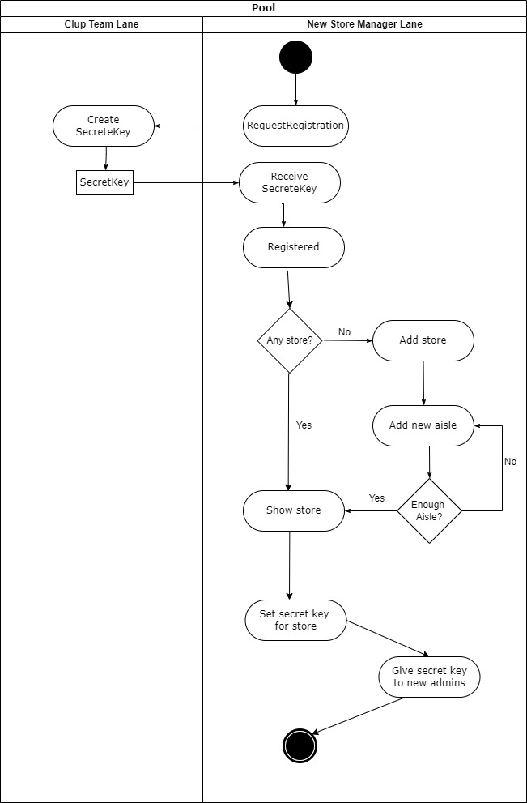
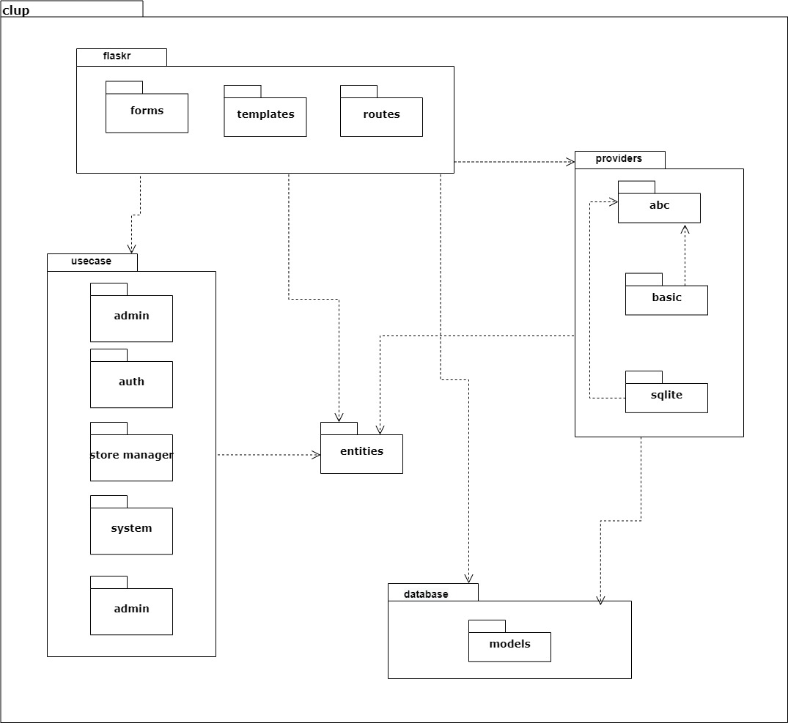
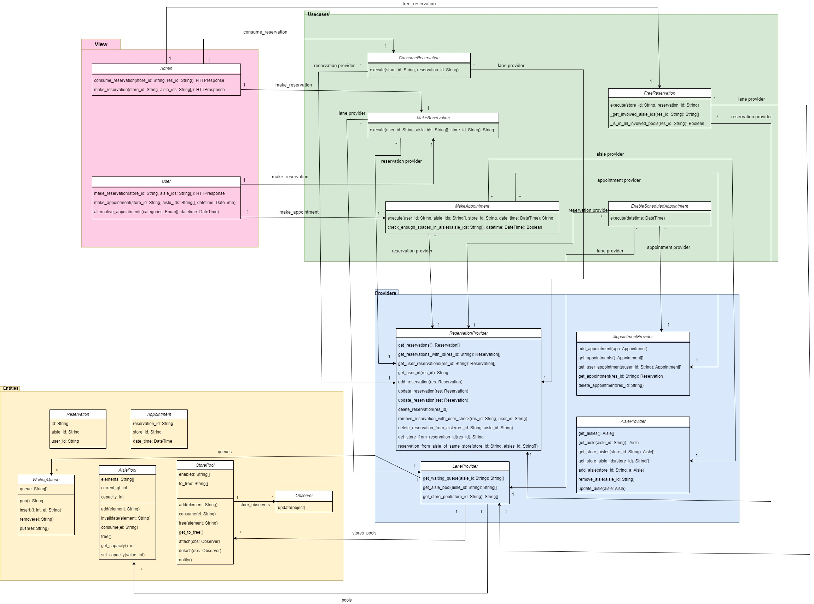

# CLup - Relazione

## Indice

1. Introduzione
2. Architettura
3. Principi SOLID
5. TDD
6. Observer Pattern
7. Data Mapper
8. Template View Pattern
9. Tools and Technologies
10. Git Strategy
11. Diagrammi
12. Understand

## Introduzione

Il progetto si pone come obbiettivo la creazione di un sistema di prenotazioni online presso i negozi per potersi mettere in coda comodamente da casa senza creare affollamenti davanti ai negozi.  
Gli Utenti, una volta registrati con la propria email, possono cercare i negozi ed effettuare delle prenotazioni istantanee o programmate, indicando anche le eventuali categorie di prodotti da acquistare per una migliore gestione degli ingressi. Una volta che la prenotazione e' abilitata all'ingresso viene inviata una mail con il QR Code che puo' essere scannerizzato dall'Amministratore del negozio.  
Gli Amministratori di negozio sono invece deputati alla gestione dei flussi di ingresso: *consumano* e *liberano* le varie prenotazioni scannerizzando il QR Code dell'utente all'ingresso e all'uscita. Possono anche generare QR da stampare per gli utenti con scarsa dimestichezza con sistemi informatici o che ancora non hanno un account.  
Infine i Manager dei negozi sono i deputati all'*inserimento* nel sistema degli store, con conseguente creazione dei vari reparti e relative categorie.  
Il sistema si basa sul *Reparto* come unita' di accesso al negozio con una propria coda di attesa che viene combinata con quella degli altri reparti se l'utente prenota su piu' reparti/categorie.  

## Architettura

L'architettura di riferimento e' la 'Clean Architecture' elaborata da Robert C. Martin [link]().  
Il principio di fondo e' la separazione delle responsabilita' e la facile estendibilita' del progetto; cio' viene realizzato strutturando le dipendenze del codice verso la 'Business Logic' e le 'Entities' che sono il cuore dell'applicazione.  
Di fatti la scelta di come viene realizzata la UI o che tipologia di database viene utilizzato sono dettagli implementativi che sono molto piu' soggetti a variazioni rispetto alle operazioni logiche del progetto; percio' con la 'Clean Architecture' si isolano i Casi d'Uso e le Entita' da queste componenti.  
In questo modo si evita di dipendere dal framework di riferimento; per questo progetto si e' utilizzato `flask` per la gestione delle pagine html ma dalla struttura del codice e' evidente che si puo' benissimo utilizzare un altro framework o addirittura creare un'interfaccia da linea di comando per la 'Business Logic', questo perche' quest'ultima e' totalmente indipendente dai meccanismi di visualizzazione/interazione dell'utente.  
Analogamente, attualmente si fa uso di `sqlite` come dbms, ma nulla vieta in futuro di scambiarlo con MySql, MongoDB o similari, questo perche' i Casi d'Uso dipendono non dall'effettiva implementazione dei `provider` bensi da un'interfaccia ben definita; se un altro provider soddisfa questa interfaccia allora e' possibile scambiarlo senza compromenttere le funzionalita' della logica.  
Le dipendenze (a livello di software) puntano verso l'interno: Web > Controller > Usecase > Entities. In pratica le componenti piu' interne sono quelle che meno devono risentire dei cambiamenti esterni perche' generalmente sono quelle piu' stabili, permettendo invece, per esempio, facili cambiamenti nella logica di visualizzazione.  

## SOLID

I principi architetturali di riferimento, che sono anche alla base della 'Clean Architecture', sono i **SOLID**.  
  
Il **Single Responsibility Principle** afferma di raggruppare le cose che hanno la stessa ragione di cambiare. A livello architetturale la ragione di cambiamento sono gli interessi dei vari attori del sistema: utenti, amministratori e proprietari di store hanno interessi ed esigenze differenti rispetto all'applicazione, percio' si e' cercato di organizzare il codice rispecchiando questa divisione.  Infatti mentre certi casi d'uso o operazione possono inizialmente sembrare comuni e condivise e' probabile che con l'evolvere del sistema si diversifichino, e in mancanza di appropriate precauzione risultera' sempre piu' difficile cambiare il codice per adattarlo alle nuove esigenze.  
  
L'**Open-Closed Principle** afferma che i sistemi devono essere aperti alle estensioni ma chiusi alle modifiche. Una buona architettura garantisce che idealmente i cambiamenti sul codice esistente per l'introduzione di nuove features siano idealmente nulli. Naturalmente cio' e' quasi impossibile ma una buona approssimazione la si ottiene organizzando le componenti in modo tale che la logica non dipenda dai dettagli implementativi. Nel progetto i casi d'uso rappresentano operazioni 'quasi atomiche', l'introduzione di nuove features tendenzialmente implica nuovi algoritmi e processi per elaborare le entita', percio' sara' sufficiente aggiungere nuovi casi d'uso ed entita' per implementare queste funzionalita' senza andare a modificare quelle preesistenti che a questo punto potranno essere mantenute o scartate. Un esempio lo si vede nella gestione degli `aisle_pool` e `store_pool`: queste entita' sono dei semplici contenitori di dati con logice di acesso molto semplici, sono i casi d'uso che implementano la logica con cui le `reservations` vengono spostate da un container all'altro, se un domani sorgesse la necessita' di far saltare la coda ad un cliente con disabilita' o differenziare l'accesso in base al tipo di utente sara' sufficiente implementare nuovi casi d'suo con queste logiche.  
  
Il **Liskov Substitution Principle** e' una guida per definire le interfacce del nostro sistema, di fatti supponiamo di avere del codice P che fa uso di un oggetto S, se esistesse un altro oggetto T con la stessa interfaccia di S, allora sostituire S con T non dovrebbe modificare il comportamento di P. Quest e' molto importante nella costruzione dei casi d'uso, essi dipendono da un'interfaccia per precisa dei provider ma fintanto che questa viene mantenuta il caso d'uso non modifica la propria logica. Di fatti inizialmente i provider erano costruiti con semplici liste di oggetti a runtime, successivamente si sono evoluti in sqlite provider ma siccome le signature delle classi erano le stesse i casi d'uso hanno continuato a comportarsi allo stesso modo.  
  
L'**Interface Segregation Principle** suggerisce di non dipendere da concetti/codice che non viene effettivamente utilizzato. Si immagini di voler utilizzare una componente di un framework ma questo framework dipende a sua volta ad esempio da uno specifico database, se qualcosa si rompesse in futuro sul database cio' renderebbe inutilizzabile il framework anche se non si fa uso del database. L'applicazione di questo principio si nota nella molteplicita' di `provider` che sono stati creati, tutti fanno riferimento allo stesso database ma ne offrono una 'vista' ben specifica e indipendente a seconda delle entita' di cui si interessano. Se un domani l' `adminprovider` avesse dei bug, i casi d'uso che avessero solo bisogno degli `user`, siccome usano l' `userprovider` non risentirebbero di tali problemi. Cio' comporta una notevole flessibilita' dell'intero sistema a discapito di una maggiore complessita' dell'architettura.  
  
Infine il **Dependency Inversion Principle** e' quello che di fondo garantisce la modularita' del sistema. A runtime la logica deve necessariamente parlare con il db e la view, ma architetturalmente le due componenti non devono sapere nulla delle altre, cio' viene ottenuto facendo dipendere i casi d'uso su astrazioni stabili (come le ABC definite per i provider) e passando gli oggetti effettivi che implementano queste interfaccie nel costruttore. In questo modo il caso d'uso non conosce l'effettiva implementazione che andra' ad utilizzare e percio' non ha una dipendenza diretta su quell'oggetto.  
  

## TDD

Per lo sviluppo del codice si e' tentato per quanto possibile di applicare l'approccio del Test-Driven Development.  
Questo consiste in 3 regole principale:

* Creare uno unite test che fallisce
* Scrivere codice sufficiente per passare il test
* Refactoring del codice
Questo porta molteplici benefici:  
* si crea una rete di test che va a garantire che il codice si comporti in modo atteso ma soprattutto favorisce il cambiamento: se ho dei test che validano il comportamento di un oggetto non si ha 'paura' di mettere mano al codice per migliorarlo
* favorisce la creazioni di classi testabili e quindi una miglior separazione delle responsabilita'
* evita l'overengineering della logica quando in realta' basterebbero implementazioni molto piu' semplici di quanto preventivato

## Observer Pattern

Questo pattern si applica nei contesti in cui certi oggetti detti `Observer` devono reagire a degli eventi generati in altre classi detti `Subject`. E' stato utilizzato per implementare il meccanismo di notifica via mail degli utenti quando la loro `reservation` viene abilitata.
```python
import abc

class Observer(abc.ABC):
    @abc.abstractmethod
    def update(self, subject):
        pass


class Subject(abc.ABC):
    @abc.abstractmethod
    def attach(self, observer):
        pass

    @abc.abstractmethod
    def detach(self, observer):
        pass

    @abc.abstractmethod
    def notify(self):
        pass
```
Queste sono le interfacce necessarie per implementare il pattern Observer. Di seguito invece le due implementazioni specifiche:
```python
from src.clup.entities.subject_abc import Subject


class StorePool(Subject):
    def __init__(self):
        self.enabled = []
        self.to_free = []
        self.last_added = None
        self._observers = []

    def add(self, element):
        self.enabled.append(element)
        self.last_added = element
        self.notify()

    # Snip..
    
    def attach(self, observer):
        self._observers.append(observer)
    
    def detach(self, observer):
        self._observers.remove(observer)

    def notify(self):
        for observer in self._observers:
            observer.update(self)
```
```python
from src.clup.entities.observer_abc import Observer


class NotifyEnabledReservationOwner(Observer):
    def __init__(self, reservation_provider, user_provider, email_service_provider):
        # Snip..

    def execute(self, reservation_id):
        user_id = self.reservation_provider.get_user_id(reservation_id)
        user = self.user_provider.get_user(user_id)
        # Snip <create email> ..
        self.email_service_provider.send(user.username, msg)

    def update(self, store_pool):
        reservation_id = store_pool.last_added
        self.execute(reservation_id)
```

## Data Mapper

Utilizzando SQLAlchemy per la creazione e gestione del database abbiamo avuto accesso ad una libreria che implementa il pattern Data Mapper, questo ci permette di creare delle classi `python` che si interfacciano con il db astraendone la struttura interna.
SQLite table representation:
```bash
sqlite> PRAGMA table_info(account);
0|id|INTEGER|1||1
1|uuid|VARCHAR|0||0
2|username|VARCHAR|0||0
3|password_hash|VARCHAR|0||0
4|type|VARCHAR|0||0
```
SQLAlchemy mapped Account class:
```python
class Account(Base):
    __tablename__ = 'account'
    id = Column(Integer, primary_key=True)
    uuid = Column(String, unique=True)
    username = Column(String, unique=True)
    password_hash = Column(String)
    type = Column(String)
```

## Template View Pattern

Per la realizzazione delle pagina HTML si e' fatto uso della Jinja template library di flask che permette di meglio separare la logica di visualizzazione dall'effettiva realizzazione delle pagine. Tramite l'utilizzo di apposita sintassi si inseriscono dei *markers* all'interno del codice HTML che poi il controller va a popolare.
```html
<head>
    <title>Titolo</title>
</head>
<body>
    
    <p>Store: {{ store.name }}</p>
</body>
```
Questo esempio dimostra la possibilita' attraverso i templates di rendere modulabili le pagine, ad esempio creando in appositi file componenti comuni come la navigation, e di inserire valori acquisiti e preprocessati dal controller in modo tale che la pagina debba solo mostrarli a schermo.  

## Tools and Technologies

* **Python3**
* **Flask**: micro-framework Web scritto in Python, basato sullo strumento Werkzeug WSGI e con il motore di template Jinja2, con l'obbiettivo di essere semplice, facile e senza vincoli predefiniti che magari un framework piu' strutturato come Django puo' imporre. E' stato utilizzato per la creazione e la gestione delle pagine web
* **SqlAlchemy**: per quanto riguarda la gestione del database abbiamo utilizzato SqlAlchemy che è  un open-source SQL toolkit e un object-relational mapper per il linguaggio di programmazione Python, permette infatti di gestire un database senza scrivere una riga di codice di pure SQL mappando tabelle e query su oggetti python
* **Bootstrap**: usato per lo stile e la grafica delle pagine in modo da ottenere pagine che si addattano al dispositivo di visualizzazione
* **Javascript**: nelle pagine html per gestire parte della logica di visualizzazione e la creazione dei QR Code
* **JQuery**: libreria Javascript per facilitare la ricerca di elementi nel DOM, l'assegnamento di event handler e la generazione di richieste HTTP all'interno della pagina
* **SQLite**: libreria compatta e veloce che implementa un DBMS SQL
* **GitHub**: di github abbiamo sfruttato le git action come meccanismo di controllo della qualità e della correttezza del nostro codice, non essendo python un linguaggio compilato ma interpretato non era possibile far eseguire le build, percio' erano responsabili dell'esecuzione dopo ogni push dei test e di un tool di linting, `flake8`, garantendo quindi di non rompere nulla alla push del nuovo codice, e garantendo ordine e leggibilita' ottimali del codice dal momento che il linting fa riferimento al PEP8 di python (le linee guida di stile del codice)
* **SonarCloud**: usato per analizzare il software e garantire un rating di A in tutte le categorie
* **Understand**: abbiamo utilizzato il software Understand per l’individuazione di possibili anti-pattern architetturali, grazie ad esso abbiamo verificato per esempio che non ci fossero dipendenze cicliche

## Git Strategy

Come strategia di branching abbiamo tendenzialmente seguito il modello [GitHub Flow]() percio':

* nel `main` era quasi sempre presente una versione del codice funzionante e deployabile (cosa garantita anche dalle gitactions)
* per introdurre le nuove feature venivano creati dei branch ad hoc con nomi descrittivi nei quali avveniva lo sviluppo e una volta pronti si procedeva al merge con il `main`; questo ha permesso di lavorare in maniera indipendente e di avere una ripartizione del lavoro semplice ed efficacie
* push costanti al repository remoto venivano fatte con la duplice motivazione di avere una copia in cloud e per rendere disponibile il proprio lavoro agli altri qualora fosse necessario lavorare in contemporanea sulla stessa feature

Abbiamo deciso di non rimuovere i branch delle feature vecchie come “documentazione/storico” del lavoro, anche se una volta fatta la merge del branch col main potrebbero benissimo essere cancellati per lasciare la struttura del repository più pulita possibile.

## Diagrammi

#### Modello di Dominio:


  

#### Diagramma dei Casi dUso:


  

#### Sequence Diagram del MakeReservation:


  

#### Diagramma Stati del MakeReservation:


  

#### Sequence State Diagram del MakeAppointment:


  

#### Diagramma delle Attivita dello Store Manager:


  

#### Diagramma Architettura Software


  

#### Diagramma delle Classi di Progettazione


  

## Understand

[..]
